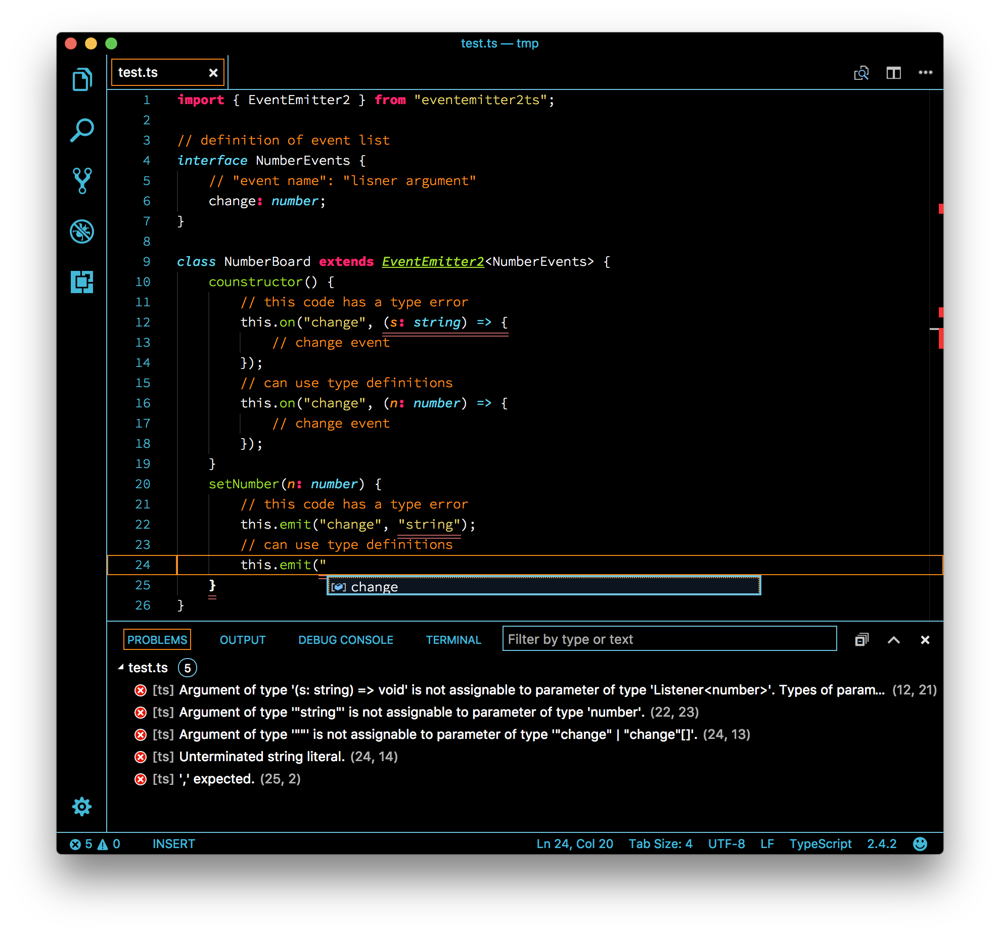

# eventemitter2ts 

This adds type definitions to events of eventemitter2 for typescript.

```
npm install --save eventemitter2ts
```



```typescript
import { EventEmitter2 } from "eventemitter2ts";

// definition of event list
interface NumberEvents {
	// "event name": "lisner argument"
	change: number;
}

class NumberBoard extends EventEmitter2<NumberEvents> {
	counstructor() {
		// this code has a type error
		this.on("change", (s: string) => {
			// change event
		});
		// can use type definitions
		this.on("change", (n: number) => {
			// change event
		});
	}
	setNumber(n: number) {
		// this code has a type error
		this.emit("change", "string");
		// can use type definitions
		this.emit("change", n);
	}
}
```
